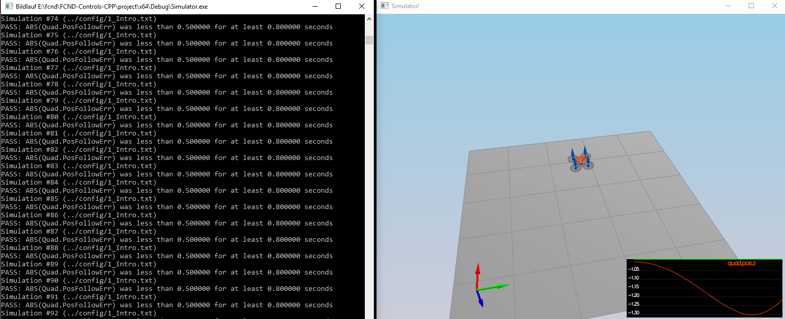
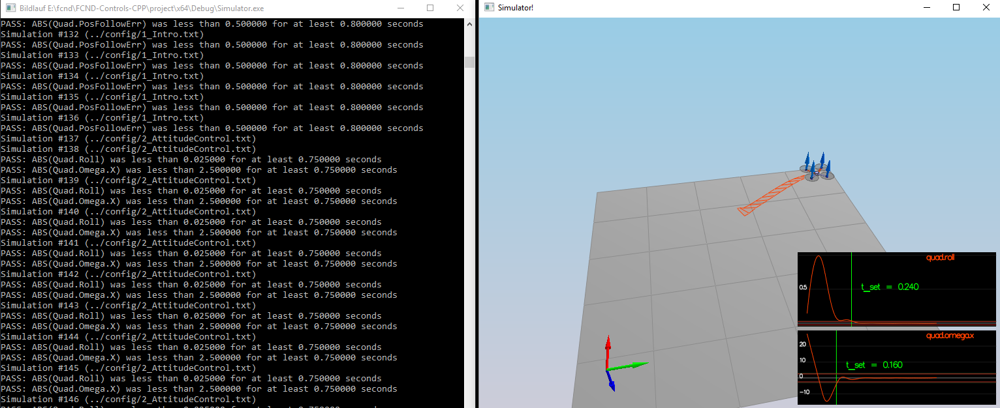
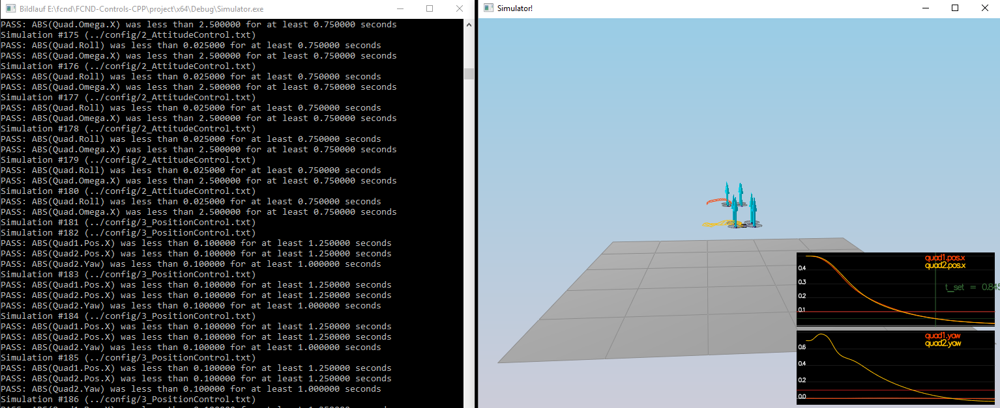
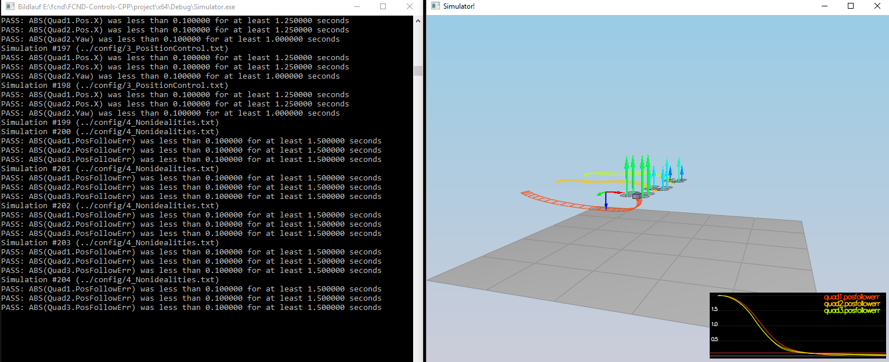
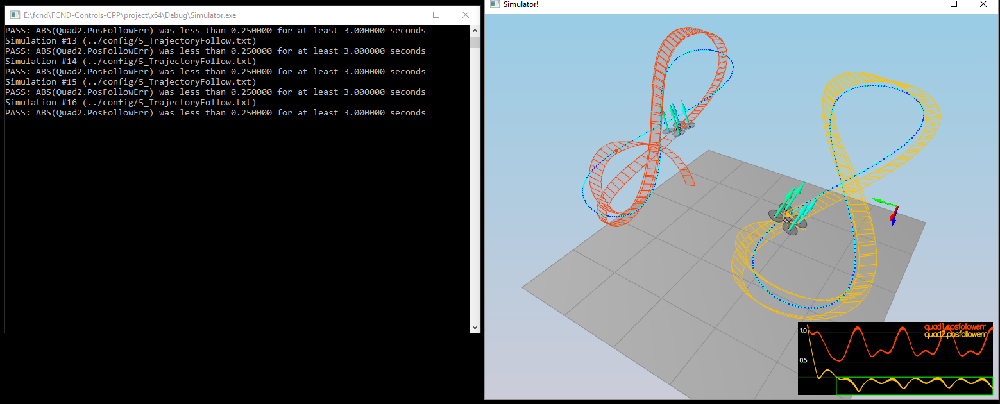

# Write up

This was the toughest project so far. It required lots of math, euler angles, Quaternions and Rotation.

See also: [Representing attitude](https://www.astro.rug.nl/software/kapteyn/_downloads/attitude.pdf) 

As per recommendation from Andrea Schoellig in Lesson 4, Controller Design 2, the scenarios followed the ideal
implementation path of:
1. Body rate
2. Pitch, Roll
3. Yaw
4. Altitude
5. Lateral position

## Scenario 1 - Intro

This scenario was just for getting into the game and checking out the simulator and
its configuration possibilities. Body `mass` in `QuadControlParams.txt` was set `0.5` by trial and error, but which could also be seen from the `QuadPhysicalParams.txt` configuration.

## Scenario 2

### Body rate and roll/pitch control 

This scenario needed to implement the `BodyRateControl()` and `RollPitchControl()` as well as `GenerateMotorCommands()`

Tuned `kpPQR` in `QuadControlParams.txt` to stop the spinning motion.

## Scenario 3

### Position/velocity and yaw angle control

Implementation of `LateralPositionControl()`,`AltitudeControl()` and `YawControl()` for stable hovering of  quads.

To achieve this, fine tuning `kpPosZ`, `kiPosz`, `kpVelXY`, `kpVelZ`,`kpYaw` and `z of kpPQR` in `QuadControlParams.txt` was needed.

## Scenario 4

### Non-idealities and robustness

3 quads with different physics had to fly 1 meter forward with nearly identical motion. This covers finetuning of params
as well as changing `AltitudeControl()` for better supporting vehicles with different masses.

## Scenario 5

### Trajectory tracking

After passing the previous scenarios, our drone needed to follow figure 8 trajectories. The orange quad was quite good
following, whereas the red one had problems. 

